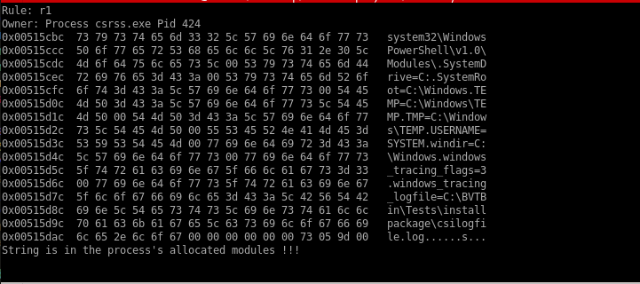

# memgrep_volatility_plugin
### Overview
Given a string or regular expression, this plugin prints all its occurrences and for each one tells where it is located in the memory dump  (virtual address, allocated or unallocated block, kernel vs process memory, heap vs stack vs data sections)
This is somehow similar to running strings+memap plugin.
### Requirements

- Python 2.6 or later, but not 3.0
- distorm3
- yara-python

### Quick Start

To search for a simple string in any process and dump the memory segments containing a match as well as the location of the match inside the alloacted/unalloacated blocks:
    
    $ python vol.py --plugin='Full path to where you put the megvo plugin'
    --profile='Select the adequate profile for your memory sample' -f 'Full path to
    your memory sample' megvo -Y 'String to search'

#### The main work in this plugin was done in the _scan_process_memory function in which I managed to :
 ##### 1) Extract all the blocks that were alloacted for a specific data section, namely the heap, the stack and modules of each process 
 
 ##### 2) Find the location of the searched string in the memory blocks of the sample and print out whether it is in kernel memory or process memory, its owner, its virtual address, whether it belongs to the heaps or the stacks or the modules of the process
 
 ###### Examples of output when looking for the string 'system' inside a memory sample:
 
 - 
 - 
